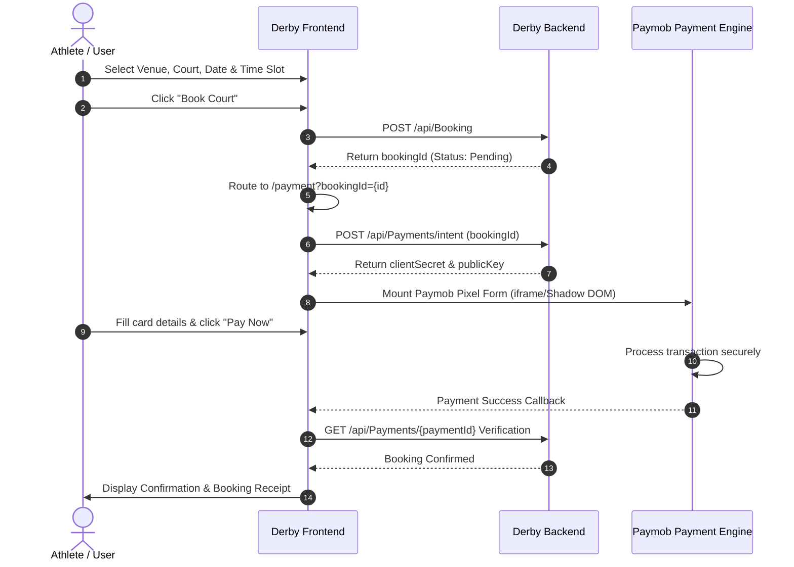

# ⚽ Derby — Sports Facilities & Court Booking Platform

[](https://reactjs.org/)
[](https://vitejs.dev/)
[](https://tailwindcss.com/)
[](#)
[](https://nodejs.org/)
[](https://www.npmjs.com/)

> **Derby** is a high-performance, modern sports facility and court booking platform. Designed for athletes, clubs, and sports enthusiasts, Derby streamlines the discovery, slot reservation, and payment process for football fields, padel courts, and multisport arenas.

---

## 📑 Table of Contents

- [Overview](#-overview)
- [Key Features](#-key-features)
- [Tech Stack & Libraries](#-tech-stack--libraries)
- [Project Architecture & Structure](#-project-architecture--structure)
- [Getting Started](#-getting-started)
  - [Prerequisites](#prerequisites)
  - [Installation](#installation)
  - [Environment Configuration](#environment-configuration)
  - [Running the Development Server](#running-the-development-server)
  - [Building for Production](#building-for-production)
  - [Code Quality & Linting](#code-quality--linting)
- [Environment Variables](#-environment-variables)
- [API & Backend Integration](#-api--backend-integration)
- [Payment Gateway Flow](#-payment-gateway-flow)
- [Deployment](#-deployment)
- [Contributing & Roadmap](#-contributing--roadmap)

---

## 🌟 Overview

**Derby** delivers an intuitive digital sports reservation experience. Users can explore clubs and facilities across multiple cities, inspect court surface types, view real-time availability schedules, reserve dynamic slots, and complete seamless online payments.

The frontend is built with **React 18** and **Vite**, utilizing a tailored **dark-neon visual identity** (`#b6ff1a` / `#a8ff00`) with glassmorphic cards, fluid micro-interactions, and accessible responsive layouts.

---

## 🚀 Key Features

### 1. 🔐 Robust Authentication & Social Login
- **Standard Authentication**: Secure email and password registration and login.
- **Social OAuth**: One-tap sign-in with **Google OAuth** (`@react-oauth/google`) and native **Facebook Login SDK**.
- **Multi-Step Onboarding**: Wizard-style profile completion with personal details and password creation.
- **Password Recovery & OTP**: 6-digit OTP verification flow with automated resend countdown timers and password reset.
- **Session Management**: Persistent JWT access & refresh token lifecycle managed with React Context and automatic Axios authorization headers.
- **Route Guards**: Protected route wrapper (`<ProtectedRoute>`) ensuring authorized access to sensitive flows like checkout and payments.

### 2. 🏟️ Facility & Court Search and Filtering
- **Multi-City & Multi-Sport Discovery**: Filter venues across cities (Cairo, Giza, Alexandria) and sports categories (Football, Padel, Tennis).
- **Live Search & Instant Filtering**: Real-time filtering by facility name, rating, address, and pricing tier.
- **Venue Showcase**: Detailed venue pages with operational hours, venue ratings, Google Maps integration, direct contact triggers, and amenity badges (WiFi, Parking, Showers, Lockers, Sports Cafe, Viewing Areas).

### 3. ⏱️ Dynamic Booking & Slot Selection
- **Interactive Calendar Chips**: Quick-select dates (`Today`, `Tomorrow`, upcoming dates) or custom date pickers.
- **Live Court Availability**: Real-time query integration with the backend availability engine (`/api/courts/{id}/availability`).
- **Surface Type Indicators**: Visual badges indicating court surfaces (e.g., Clay, Panoramic Glass, Acrylic, Hard Court, Artificial Turf).
- **Slot Selection State Machine**: Instant slot selection per court, collision prevention, and automatic session state preservation if an unauthenticated user attempts to book.

### 4. 💳 End-to-End Payment Integration Flow
- **Multi-Step Checkout**: Clear progression through *Booking Details* &rarr; *Paymob Embedded Card Checkout* &rarr; *Order Review* &rarr; *Instant Confirmation*.
- **Paymob Pixel SDK**: Embedded PCI-compliant card fields inside Shadow DOM styled natively to match Derby's dark/neon aesthetic.
- **Payment Intent Lifecycle**: Automated intention generation via `/api/Payments/intent` and status verification.
- **Downloadable Receipts**: Booking summary cards with transaction IDs, facility details, and slot timestamps.

### 5. 🎨 Responsive Dark-Themed UI
- **Cyber-Sport Aesthetic**: Sleek obsidian canvas (`#0e0f0c` / `#121417`) highlighted by vibrant neon lime accents (`#a8ff00` / `#b6ff1a`).
- **Design System**: Modular UI library consisting of customized Buttons, Inputs, Modals, Spinners, OTP digit inputs, and Badges.
- **Mobile-First Responsiveness**: Handcrafted responsiveness across mobile handsets, tablets, and wide desktop screens.

---

## 🛠️ Tech Stack & Libraries

### Core Technologies
| Layer | Technology | Description |
| :--- | :--- | :--- |
| **Runtime** | [Node.js](https://nodejs.org/) (`>= 18.0.0`, tested on `v20.x` & `v22.x`) | JavaScript runtime environment |
| **Package Manager**| [npm](https://www.npmjs.com/) (`>= 9.0.0`) | Dependency manager |
| **Framework** | [React 18](https://react.dev/) (`v18.3.1`) | UI component library |
| **Build Tool** | [Vite 5](https://vitejs.dev/) (`v5.3.4`) | Next-generation frontend tooling and HMR dev server |
| **Language** | ECMAScript (ES Modules, JSX) | Modern JavaScript standards |

### UI, Styling & Design System
- **[Tailwind CSS](https://tailwindcss.com/) (`v3.4.6`)**: Utility-first CSS framework with custom theme extensions.
- **[Bootstrap 5](https://getbootstrap.com/) & [React-Bootstrap](https://react-bootstrap.netlify.app/) (`v2.10.10`)**: Grid utilities and payment modal structure.
- **[PostCSS](https://postcss.org/) & [Autoprefixer](https://github.com/postcss/autoprefixer)**: CSS processing and cross-browser vendor prefixing.
- **Custom CSS Modules & Theming**: Scoped styles for complex flows (Payment steps, Details page, glow effects).

### Routing & State Management
- **[React Router DOM](https://reactrouter.com/) (`v6.24.1`)**: Client-side declarative routing with nested layout routes and navigation guards.
- **React Context API**: Centralized state management for authentication, user session, and token persistence (`AuthContext`).

### Forms & Validation
- **[React Hook Form](https://react-hook-form.com/) (`v7.52.1`)**: Performant form handling with minimized re-renders.
- **[Zod](https://zod.dev/) (`v3.23.8`)**: TypeScript-first schema validation for registration, login, and profile forms.
- **[@hookform/resolvers](https://github.com/react-hook-form/resolvers)**: Zod resolver bridge for React Hook Form.

### HTTP Client & Networking
- **[Axios](https://axios-http.com/) (`v1.7.2`)**: Promise-based HTTP client configured with baseURL, request interceptors (Bearer token attachment), and centralized error handling.

### Authentication & Social SDKs
- **[@react-oauth/google](https://www.npmjs.com/package/@react-oauth/google) (`v0.13.5`)**: Official Google Identity Services integration.
- **Facebook JavaScript SDK**: Custom async loader for Facebook Graph API authentication.

### Payments & External Services
- **[Paymob Pixel](https://www.npmjs.com/package/paymob-pixel) (`v1.2.7`)**: Secure client-side payment processing SDK for credit/debit card transactions.

### Iconography
- **[Lucide React](https://lucide.dev/) (`v0.395.0`)**: Modern outline icon set.
- **[React Icons](https://react-icons.github.io/react-icons/) (`v5.7.0`)**: Comprehensive iconography including Bootstrap Icons (`bs`).
- **[FontAwesome](https://fontawesome.com/) (`v7.3.1`)**: SVG core icons for specialized sports and UI marks.

---

## 📁 Project Architecture & Structure

The codebase is organized using a **feature-driven and modular component architecture**:

```text
Derpy-Project/
├── public/                     # Static public assets (favicons, icons, robots.txt)
├── src/
│   ├── api/                    # Centralized API service modules
│   │   ├── apiClient.js        # Base Axios client with request/response interceptors
│   │   ├── authToken.js        # Local token extraction & header helpers
│   │   ├── clubApi.js          # Clubs, courts & live availability endpoints
│   │   ├── paymentApi.js       # Bookings, payments & Paymob intention APIs
│   │   └── aboutApi.js         # About & club metadata queries
│   │
│   ├── app/                    # Application layer wiring
│   │   ├── providers/          # Global Context providers (AuthContext.jsx)
│   │   └── routes/             # AppRoutes.jsx and ProtectedRoute.jsx
│   │
│   ├── assets/                 # Static images, hero banners, court mockups & badges
│   │   └── details/            # Facility, surface & amenity icons
│   │
│   ├── components/             # Reusable UI & layout components
│   │   ├── AboutUs/            # About page components
│   │   ├── layout/             # MainLayout, AuthLayout, Navbar, and Footer
│   │   ├── Payment/            # Multi-step checkout system
│   │   │   ├── PaymenyPage/    # Payment orchestration container
│   │   │   │   └── steps/      # Information, Payment, Review, Confirmation steps
│   │   │   └── theme.css       # Paymob dark-neon token styling
│   │   ├── Stepper/            # Multi-step progress indicators
│   │   ├── TopBar/             # Announcement and secondary navigation bar
│   │   └── ui/                 # Atomic UI primitives (Button, Input, Modal, OTPInput, Spinner, Alert)
│   │
│   ├── config/                 # App configurations and constants
│   │   ├── axios.js            # Axios client instances
│   │   └── constants.js        # API endpoints, route definitions, OAuth constants
│   │
│   ├── data/                   # Mock data and fallback static definitions
│   │
│   ├── features/               # Feature-specific modules
│   │   ├── auth/               # Authentication domain
│   │   │   ├── api/            # authApi.js, tokenService.js
│   │   │   ├── components/     # LoginForm, RegisterForm, OTPForm, ForgotPasswordForm, etc.
│   │   │   ├── hooks/          # useAuth.js, useOTPCountdown.js
│   │   │   ├── schemas/        # Zod validation schemas
│   │   │   └── utils/          # facebookSdk.js loader
│   │   ├── home/               # Home page sections
│   │   │   └── components/     # HeroSection, ExploreSports, PopularVenues, StatsBar, WhyUs
│   │   └── legal/              # Privacy policy and terms views
│   │
│   ├── pages/                  # Page-level route views
│   │   ├── auth/               # LoginPage, RegisterPage, ForgotPasswordPage, ResetPasswordPage, Welcome
│   │   ├── Details/            # DetailsPage.jsx & DetailsPage.css (Facility booking view)
│   │   ├── tournament/         # TournamentPage.jsx (Tournaments & matches)
│   │   ├── ContactPage.jsx     # Contact & inquiries page
│   │   ├── HomePage.jsx        # Landing page
│   │   ├── OtpPage.jsx         # Standalone OTP verification page
│   │   └── PricingPage.jsx     # Facility search, filters & court discovery
│   │
│   ├── styles/                 # Global styling rules
│   │   └── globals.css         # Tailwind directives, theme variables & custom utilities
│   │
│   ├── utils/                  # Shared helper functions (pricing, date formatting, storage)
│   ├── App.jsx                 # Root layout container
│   └── main.jsx                # React DOM root entry with Provider hierarchy
│
├── .env                        # Local active environment configuration (git-ignored)
├── .env.example                # Example environment variables template
├── index.html                  # HTML entry point with Google Fonts & meta tags
├── package.json                # Project dependencies and npm scripts
├── postcss.config.js           # PostCSS plugins configuration
├── tailwind.config.js          # Tailwind CSS custom palette and screen breakpoints
├── vercel.json                 # Vercel deployment and SPA client-side routing rewrites
└── vite.config.js              # Vite configuration with path aliases & API proxy
```

---

## 🚦 Getting Started

Follow these instructions to set up the project locally on your machine.

### Prerequisites

Ensure you have the following software installed:
- **Node.js**: `v18.0.0` or higher (Recommended: LTS `v20.x` or `v22.x`)
  ```bash
  node -v
  ```
- **npm**: `v9.0.0` or higher
  ```bash
  npm -v
  ```
- **Git**: For version control

---

### Installation

1. **Clone the repository:**
   ```bash
   git clone https://github.com/your-username/derby-web.git
   cd derby-web
   ```

2. **Install project dependencies:**
   ```bash
   npm install
   ```

---

### Environment Configuration

1. **Create an environment file based on the provided template:**
   ```bash
   cp .env.example .env.local
   ```
   *(On Windows PowerShell, use `Copy-Item .env.example .env.local` or copy to `.env`)*

2. **Populate `.env.local` with your local or staging keys:**
   ```env
   # ASP.NET Core Backend Base URL
   VITE_API_BASE_URL=http://localhost:5000

   # App Information
   VITE_APP_NAME=Derby
   VITE_APP_ENV=development

   # Google OAuth Client ID
   VITE_GOOGLE_CLIENT_ID=your-google-client-id.apps.googleusercontent.com

   # Facebook OAuth App ID
   VITE_FACEBOOK_APP_ID=your-facebook-app-id
   ```

---

### Running the Development Server

Start the local Vite development server with hot-module replacement (HMR):

```bash
npm run dev
```

The application will be accessible at:
```
http://localhost:5173
```

> **Note:** The development server is configured with a reverse proxy in `vite.config.js` that forwards any `/api` requests directly to `VITE_API_BASE_URL` to avoid CORS issues during local development.

---

### Building for Production

Compile and bundle all assets into optimized production-ready static files:

```bash
npm run build
```

The production output will be generated inside the `dist/` directory.

To locally preview the production build:
```bash
npm run preview
```

---

### Code Quality & Linting

To run ESLint across all `.js` and `.jsx` files:

```bash
npm run lint
```

---

## 🔑 Environment Variables

The application relies on Vite's `import.meta.env` system. All environment variables must be prefixed with `VITE_` to be exposed to the client bundle.

| Variable Name | Type | Required | Description | Example Value |
| :--- | :---: | :---: | :--- | :--- |
| `VITE_API_BASE_URL` | String | **Yes** | Root endpoint of the backend API service (e.g., ASP.NET Core API). | `http://localhost:5000` |
| `VITE_GOOGLE_CLIENT_ID` | String | **Yes** | Client ID obtained from Google Cloud Console for Google Sign-In. | `8200822...apps.googleusercontent.com` |
| `VITE_FACEBOOK_APP_ID` | String | **Yes** | App ID registered on Meta for Developers for Facebook OAuth. | `1540732264400627` |
| `VITE_APP_NAME` | String | No | Application display title. | `Derpy` |
| `VITE_APP_ENV` | String | No | Deployment stage (`development`, `staging`, `production`). | `development` |

---

## 🌐 API & Backend Integration

The frontend connects to a RESTful backend (e.g., ASP.NET Core Web API). The primary endpoints configured in `src/config/constants.js` and `src/api/` include:

### Authentication Endpoints (`/api/User`)
- `POST /api/User/login` — User authentication with email and password.
- `POST /api/User/register` — New account registration.
- `POST /api/User/google-login` — Google credential verification & login.
- `POST /api/User/facebook-login` — Facebook access token verification.
- `POST /api/User/forgot-password` — Request password reset OTP.
- `POST /api/User/verify-otp` — Validate received OTP code.
- `POST /api/User/reset-password` — Set a new password using verified OTP token.
- `POST /api/User/refresh` — Refresh expired JWT access token.

### Facilities & Courts Endpoints (`/api/courts` & `/api/Clubs`)
- `GET /api/Clubs` — Retrieve a list of sports clubs and venues.
- `GET /api/Clubs/{id}` — Retrieve facility details and amenities.
- `GET /api/courts/{id}/availability?date=...` — Retrieve real-time available time slots for courts on a specific date.

### Booking & Payments Endpoints (`/api/Booking` & `/api/Payments`)
- `POST /api/Booking` — Reserve a court for a specified date and time slot.
- `GET /api/Booking/{id}` — Fetch booking confirmation details.
- `GET /api/Booking/me` — Retrieve current authenticated user's active bookings.
- `POST /api/Payments/intent` — Generate a Paymob payment intention for a booking.
- `GET /api/Payments/{id}` — Verify payment transaction status.

---

## 💳 Payment Gateway Flow



---

## ☁️ Deployment

The project is configured for rapid zero-configuration deployment on **Vercel**, **Netlify**, or any modern static hosting provider.

### Vercel Deployment

A ready `vercel.json` file is included in the project root:

```json
{
  "rewrites": [
    {
      "source": "/(.*)",
      "destination": "/index.html"
    }
  ]
}
```

This guarantees that HTML5 pushState routes (such as `/pricing`, `/details/3`, `/payment`) are correctly routed to `index.html` without 404 errors.

**Deploying via Vercel CLI:**
```bash
npm install -g vercel
vercel
```

**Environment Variables on Hosting:**
Remember to configure `VITE_API_BASE_URL`, `VITE_GOOGLE_CLIENT_ID`, and `VITE_FACEBOOK_APP_ID` in your production provider's dashboard settings.

---

## 🤝 Contributing & Guidelines

1. **Fork the repository**
2. **Create your feature branch:**
   ```bash
   git checkout -b feature/awesome-feature
   ```
3. **Commit your changes with clear messages:**
   ```bash
   git commit -m "feat(courts): add interactive court floor map view"
   ```
4. **Push to the branch:**
   ```bash
   git push origin feature/awesome-feature
   ```
5. **Open a Pull Request**

---

## 📄 License

This project is proprietary and confidential. All rights reserved.  
Unauthorized copying, modification, distribution, or commercial use of this software is strictly prohibited without prior written consent from the project owners.
